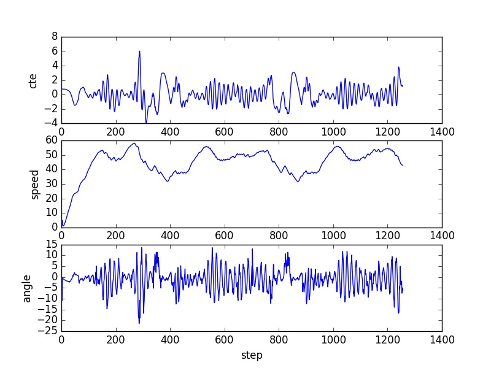
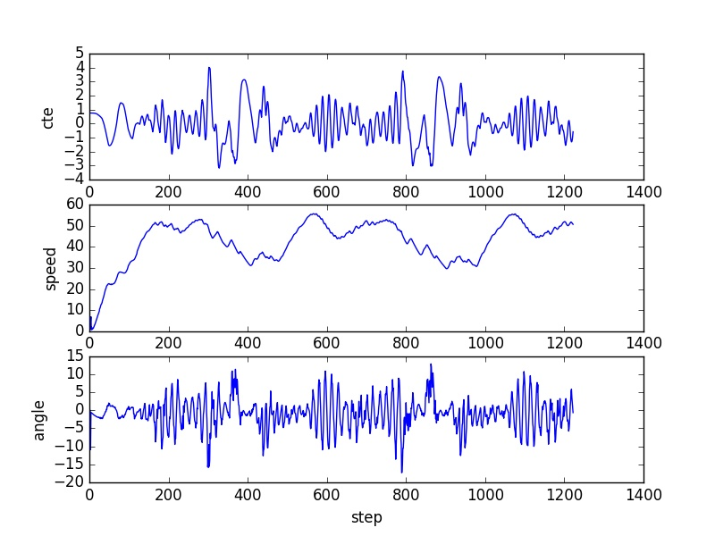
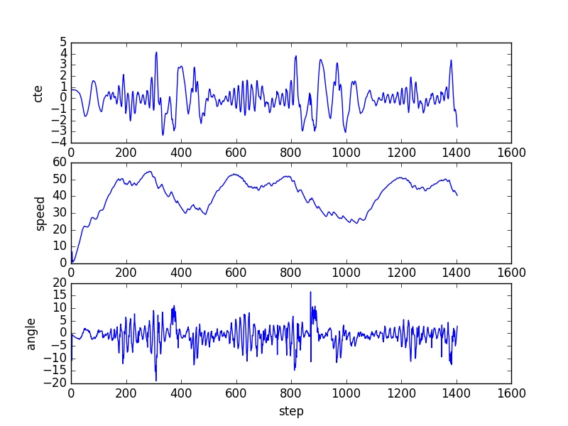

- *The effect each of the P, I, D components in PID algorithm.*
The parameter P in my parameter is to make the steering angle and the velocity proportional and opposite to the cte.If the car is far away from the center of the road the steering angle will increase in the opposite direction and the velocity will decrease.But the velocity won't be less than zero.The minimum of the throttle is set to be 0.1. 
The parameter D make the steering angle related to the temporal derivative of the crosstrack error which means when the cross track error decrease,the steering angle will portionally decrease.And this make the car oscillate less.As for throttle this parameter in my algorithm will make the throttle increase when the car is closing to the center of the road.
The parameter I make the steering angle proportional to the sum of the cross track error,this will eliminate the effects of the system error.
- *Describe how the final hyperparameters were chosen.*
Well the hyperparameters in my algorithm was chosen manully.I adjust each of the parameter to see which value makes the car run better.I adjust the parameter follow the P,D,I sequence.When one parameter is satisfactory,it will be fixed and I will adjust the next one.I also write a python script to draw the cte,velocity,steering angle with the step number as below.Through this way I find the final parameter which is [0.043,0.005,0.55] for the steering angle and [0.35,0.0001,0.1] for the velocity.And as shown in the graph,the max velocity was about 60.
- *the final result
[mv](./video/circle.m4v)
- *middle graph
# param [0.043,0.005,0.55] [0.3,0,0.1] min speed = 0.1

# param [0.043,0.005,0.55] [0.35,0,0] min speed = 0.1

# param [0.043,0.005,0.55] [0.35,0001,0.1] min speed = 0.1

# param [0.043,0.005,0.55] [0.35,00005,0.1] min speed = 0.1

# param [0.043,0.005,0.55] [0.35,00001,0.1] min speed = 0.1

# param [0.043,0.005,0.55] [0.4,0,0] min speed = 0.1

# param [0.043,0.005,0.55] [0.4,0,0.1] min speed = 0.1

# param [0.043,0.005,0.75] [0.4,0,0] min speed = 0.1

